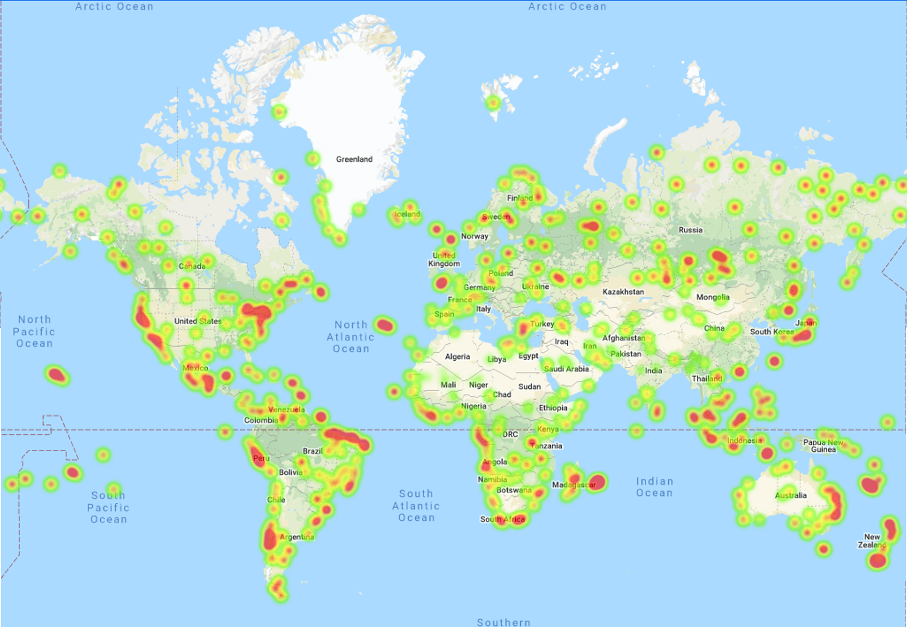

# What's the Weather Like?

## Part I - WeatherPy

[Python script](https://github.com/kioz-developer/python-api-challenge/blob/main/WeatherPy/WeatherPy.ipynb) to visualize the weather of 500+ cities across the world of varying distance from the equator with a representative model of weather across world cities.

This map shows how the humidity increase in those cities near to the sea or near to some lake

### Part II - VacationPy

[Heat map](https://github.com/kioz-developer/python-api-challenge/blob/main/VacationPy/VacationPy.ipynb) that displays the humidity for every city from Part I.